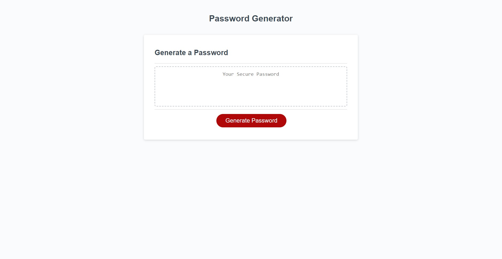
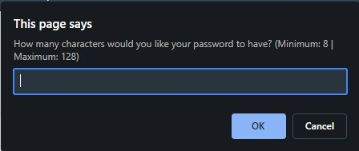
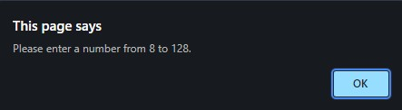
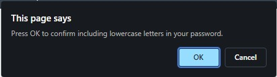
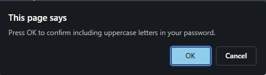
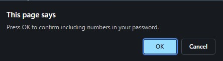
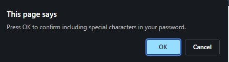
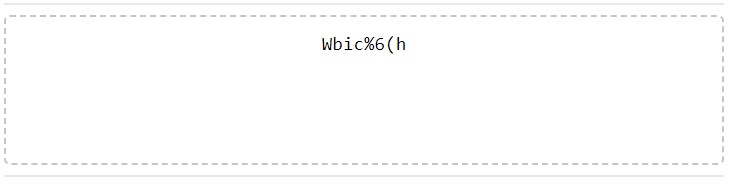
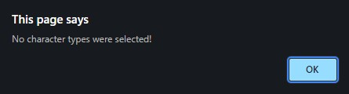

# <Your-Project-Title>

## Description

In today's era of computer technology, the requirements for having a strong, secure password have become more and more demanding. It wasn't too long ago where a password with only six lowercase letters and one number was considered "safe." Passwords nowadays typically require eight characters (a combination of lowercase and uppercase letters, numbers, and symbols) at the bare minimum. For employees with sensitive work documents and data, even longer passwords are necessary to ensure others are unable to access their files.

In hopes to improve upon the complexity of creating passwords, I added to the functionality of this website by coming up with the code to generate a random password. Sometimes, if left to individuals to come up with multiple passwords to access different sets of private information, they may be prone to using similar passwords (if not the same password) for different access points. Generating random passwords for each point of entry eliminates the possibility of someone using the same password more than once.

Upon beginning to write the necessary code to generate a random password, I very quickly noticed how conceptually simple the functions of a website are from the user point of view, but from the coder's perspective, writing functions can get overwhelming at times. For example, simply making lists of lowercase or uppercase letters is not an intuitive process in coding, and there are multiple ways to go about making alphabetical lists.

## Usage

Here is what the website looks like upon opening it: (GitHub pages URL: https://abrentis.github.io/Password-Generator/)

To generate a password, click on the 'Generate Password' button.

You will be prompted with a window to enter how many characters you would like your password length to be. If 'Cancel' is pressed, the process of generating a password is aborted.

If an invalid entry is entered and submitted pressing 'OK', a window will pop up asking you to 'Please enter a number from 8 to 128,' which will then return you to the previous window. 

For each of the following character type categories, a window pops up asking you to 'Press OK to confirm including [characters of specified character type] in your password.' If you select 'OK' for a particular character type category, characters of that character type will be included in your randomly generated password. If 'Cancel' is selected, characters of that character type will not be included in your randomly generated password, but you will have the opportunity to select other character type categories.

### Character Type Categories

Lowercase Letters

Uppercase Letters

Numbers

Special Characters

Here is an example of a randomly generated password that includes all different character types:

If you entered a valid password length but selected 'Cancel' for all character type categories, a window will pop up stating 'No character types were selected,' and a random password will not be generated.

## License

MIT License (please refer to license file in GitHub repository for more information)